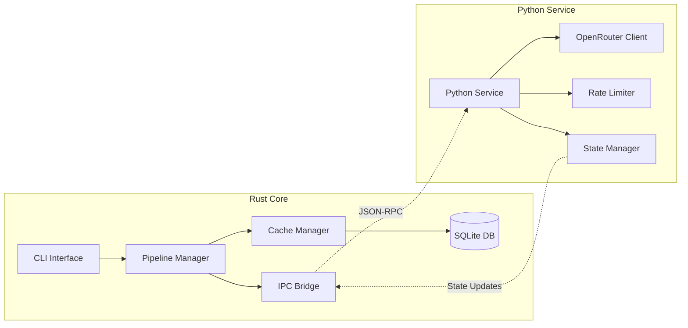

# Integration Design

**Last Updated**: 2025-01-07

## Purpose

This document details how the Rust core pipeline and Python API client components integrate to form a cohesive system for processing Korean vocabulary into flashcards.

## Integration Architecture



## Integration Strategies

### Option 1: Embedded Python (Recommended for MVP)

**Architecture**: Rust embeds Python interpreter using PyO3

```rust
use pyo3::prelude::*;
use pyo3::types::PyDict;

pub struct PythonBridge {
    gil: Python<'static>,
    api_client: PyObject,
}

impl PythonBridge {
    pub fn new() -> PyResult<Self> {
        pyo3::prepare_freethreaded_python();
        
        Python::with_gil(|py| {
            let sys = py.import("sys")?;
            let path = sys.getattr("path")?;
            path.call_method1("append", ("./src/python",))?;
            
            let module = py.import("flashcard_pipeline.api_client")?;
            let api_client = module.getattr("OpenRouterClient")?.call0()?;
            
            Ok(Self {
                gil: py,
                api_client: api_client.into(),
            })
        })
    }
    
    pub async fn process_stage1(&self, item: &VocabularyItem) -> Result<Stage1Result> {
        Python::with_gil(|py| {
            let item_dict = PyDict::new(py);
            item_dict.set_item("position", item.position)?;
            item_dict.set_item("term", &item.term)?;
            item_dict.set_item("type", &item.word_type)?;
            
            let result = self.api_client
                .call_method1(py, "stage1_semantic_analysis", (item_dict,))?;
            
            // Convert Python dict to Rust struct
            let json_str: String = result.call_method0(py, "__str__")?.extract(py)?;
            let stage1_result: Stage1Result = serde_json::from_str(&json_str)?;
            
            Ok(stage1_result)
        })
    }
}
```

**Pros:**
- Single binary deployment
- Direct function calls
- Shared memory space
- Easy state management

**Cons:**
- Python GIL limitations
- Complex error handling
- Dependency management

### Option 2: Separate Processes with IPC

**Architecture**: Rust and Python run as separate processes communicating via JSON-RPC

```rust
// Rust side
use tokio::net::UnixStream;
use jsonrpc_core::{IoHandler, Params, Value};

pub struct JsonRpcClient {
    socket: UnixStream,
}

impl JsonRpcClient {
    pub async fn call_stage1(&mut self, item: &VocabularyItem) -> Result<Stage1Result> {
        let request = json!({
            "jsonrpc": "2.0",
            "method": "process_stage1",
            "params": {
                "position": item.position,
                "term": item.term,
                "type": item.word_type
            },
            "id": 1
        });
        
        self.send_request(&request).await?;
        let response = self.receive_response().await?;
        
        Ok(serde_json::from_value(response["result"].clone())?)
    }
}
```

```python
# Python side
from jsonrpcserver import method, serve
import asyncio

@method
async def process_stage1(position: int, term: str, type: str) -> dict:
    client = OpenRouterClient()
    item = {"position": position, "term": term, "type": type}
    result = await client.stage1_semantic_analysis(item)
    await client.close()
    return result

if __name__ == "__main__":
    serve(host="localhost", port=5000)
```

## Data Serialization

### Rust → Python

```rust
#[derive(Serialize, Deserialize)]
pub struct VocabularyItem {
    pub position: i32,
    pub term: String,
    pub word_type: Option<String>,
}

impl IntoPy<PyObject> for VocabularyItem {
    fn into_py(self, py: Python) -> PyObject {
        let dict = PyDict::new(py);
        dict.set_item("position", self.position).unwrap();
        dict.set_item("term", self.term).unwrap();
        if let Some(wt) = self.word_type {
            dict.set_item("type", wt).unwrap();
        }
        dict.into()
    }
}
```

### Python → Rust

```rust
#[derive(Deserialize)]
pub struct Stage1Result {
    pub term_number: i32,
    pub term: String,
    pub ipa: String,
    pub pos: String,
    pub primary_meaning: String,
    pub other_meanings: String,
    pub metaphor: String,
    pub metaphor_noun: String,
    pub metaphor_action: String,
    pub suggested_location: String,
    pub anchor_object: String,
    pub anchor_sensory: String,
    pub explanation: String,
    pub usage_context: Option<String>,
    pub comparison: Comparison,
    pub homonyms: Vec<Homonym>,
    pub korean_keywords: Vec<String>,
}

impl<'source> FromPyObject<'source> for Stage1Result {
    fn extract(ob: &'source PyAny) -> PyResult<Self> {
        let json_str: String = ob.call_method0("__str__")?.extract()?;
        serde_json::from_str(&json_str)
            .map_err(|e| PyValueError::new_err(e.to_string()))
    }
}
```

## Error Handling

### Error Propagation Chain

```rust
#[derive(thiserror::Error, Debug)]
pub enum IntegrationError {
    #[error("Python error: {0}")]
    PythonError(String),
    
    #[error("API error: {0}")]
    ApiError(String),
    
    #[error("Serialization error: {0}")]
    SerializationError(#[from] serde_json::Error),
    
    #[error("Communication error: {0}")]
    CommunicationError(String),
}

// Convert Python exceptions to Rust errors
impl From<PyErr> for IntegrationError {
    fn from(err: PyErr) -> Self {
        Python::with_gil(|py| {
            let msg = err.to_string();
            IntegrationError::PythonError(msg)
        })
    }
}
```

### Python Exception Handling

```python
class ApiIntegrationError(Exception):
    """Base exception for integration errors"""
    pass

class RateLimitError(ApiIntegrationError):
    """Rate limit exceeded"""
    def __init__(self, retry_after: int):
        self.retry_after = retry_after
        super().__init__(f"Rate limited. Retry after {retry_after}s")

class SerializationError(ApiIntegrationError):
    """Failed to serialize/deserialize data"""
    pass

# In the API client
try:
    response = await self._make_request(payload)
except httpx.HTTPStatusError as e:
    if e.response.status_code == 429:
        raise RateLimitError(retry_after=60)
    raise ApiIntegrationError(f"HTTP {e.response.status_code}: {e.response.text}")
```

## Async Coordination

### Rust Async → Python Async

```rust
use tokio::task;

pub async fn process_batch_with_python(items: Vec<VocabularyItem>) -> Result<Vec<ProcessedItem>> {
    let (tx, mut rx) = tokio::sync::mpsc::channel(100);
    
    // Spawn Python processing tasks
    let handles: Vec<_> = items
        .into_iter()
        .map(|item| {
            let tx = tx.clone();
            task::spawn_blocking(move || {
                Python::with_gil(|py| {
                    let result = process_item_in_python(py, &item)?;
                    tx.blocking_send(result).unwrap();
                    Ok::<(), IntegrationError>(())
                })
            })
        })
        .collect();
    
    // Collect results
    drop(tx);
    let mut results = Vec::new();
    while let Some(result) = rx.recv().await {
        results.push(result);
    }
    
    Ok(results)
}
```

### Python Async → Rust Callbacks

```python
# Python side
async def process_with_callback(item: dict, callback_url: str):
    """Process item and send result to Rust via callback"""
    try:
        stage1_result = await client.stage1_semantic_analysis(item)
        stage2_result = await client.stage2_card_generation(item, stage1_result)
        
        # Send result back to Rust
        async with httpx.AsyncClient() as client:
            await client.post(callback_url, json={
                "status": "success",
                "position": item["position"],
                "result": stage2_result
            })
    except Exception as e:
        async with httpx.AsyncClient() as client:
            await client.post(callback_url, json={
                "status": "error",
                "position": item["position"],
                "error": str(e)
            })
```

## State Management

### Shared State Design

```rust
// Rust side
pub struct SharedState {
    pub processing_status: Arc<RwLock<HashMap<i32, ProcessingStatus>>>,
    pub metrics: Arc<RwLock<ProcessingMetrics>>,
}

#[derive(Clone, Serialize, Deserialize)]
pub enum ProcessingStatus {
    Queued,
    Processing { stage: u8 },
    Completed,
    Failed { error: String, retry_count: u8 },
}
```

```python
# Python side
from dataclasses import dataclass
from enum import Enum
import redis

class ProcessingStatus(Enum):
    QUEUED = "queued"
    PROCESSING = "processing"
    COMPLETED = "completed"
    FAILED = "failed"

@dataclass
class StateManager:
    redis_client: redis.Redis
    
    async def update_status(self, position: int, status: ProcessingStatus, **kwargs):
        key = f"item:{position}:status"
        data = {
            "status": status.value,
            "updated_at": datetime.utcnow().isoformat(),
            **kwargs
        }
        await self.redis_client.hset(key, mapping=data)
    
    async def get_status(self, position: int) -> dict:
        key = f"item:{position}:status"
        return await self.redis_client.hgetall(key)
```

## Deployment Strategy

### Development Setup

```bash
# Directory structure
korean-flashcard-pipeline/
├── Cargo.toml
├── pyproject.toml
├── src/
│   ├── rust/
│   │   └── main.rs
│   └── python/
│       └── flashcard_pipeline/
│           ├── __init__.py
│           └── api_client.py
└── scripts/
    └── dev.sh

# Development script (scripts/dev.sh)
#!/bin/bash
# Start Python service
cd src/python
python -m flashcard_pipeline.service &
PYTHON_PID=$!

# Run Rust pipeline
cd ../..
cargo run -- "$@"

# Cleanup
kill $PYTHON_PID
```

### Production Build

```dockerfile
# Multi-stage Dockerfile
FROM rust:1.75 as rust-builder
WORKDIR /app
COPY Cargo.toml Cargo.lock ./
COPY src/rust ./src/rust
RUN cargo build --release

FROM python:3.11-slim as python-builder
WORKDIR /app
COPY requirements.txt ./
RUN pip install --user -r requirements.txt
COPY src/python ./src/python

FROM debian:bookworm-slim
RUN apt-get update && apt-get install -y \
    ca-certificates \
    python3 \
    && rm -rf /var/lib/apt/lists/*

COPY --from=rust-builder /app/target/release/flashcard-pipeline /usr/local/bin/
COPY --from=python-builder /root/.local /root/.local
COPY --from=python-builder /app/src/python /app/python

ENV PATH=/root/.local/bin:$PATH
ENV PYTHONPATH=/app/python

ENTRYPOINT ["flashcard-pipeline"]
```

## Performance Considerations

### Connection Pooling

```python
# Python side - Singleton pattern for client
class ClientPool:
    _instance = None
    _client = None
    
    def __new__(cls):
        if cls._instance is None:
            cls._instance = super().__new__(cls)
            cls._client = OpenRouterClient()
        return cls._instance
    
    @property
    def client(self):
        return self._client
    
    async def close(self):
        if self._client:
            await self._client.close()
```

### Batch Processing Optimization

```rust
// Process items in optimally sized batches
const OPTIMAL_BATCH_SIZE: usize = 10;

pub async fn process_vocabulary_batch(items: Vec<VocabularyItem>) -> Result<Vec<ProcessedItem>> {
    let chunks: Vec<_> = items.chunks(OPTIMAL_BATCH_SIZE).collect();
    let mut all_results = Vec::new();
    
    for chunk in chunks {
        let results = Python::with_gil(|py| {
            let batch_processor = py.import("flashcard_pipeline.batch")?
                .getattr("BatchProcessor")?;
            
            let items_py = chunk.to_vec().into_py(py);
            let results = batch_processor.call_method1("process_batch", (items_py,))?;
            
            Ok::<Vec<ProcessedItem>, PyErr>(results.extract()?)
        })?;
        
        all_results.extend(results);
    }
    
    Ok(all_results)
}
```

## Testing Integration

### Integration Test Setup

```rust
#[cfg(test)]
mod integration_tests {
    use super::*;
    
    #[tokio::test]
    async fn test_full_pipeline_integration() {
        // Start mock Python service
        let mock_service = MockPythonService::start().await;
        
        // Create test item
        let item = VocabularyItem {
            position: 1,
            term: "테스트".to_string(),
            word_type: Some("noun".to_string()),
        };
        
        // Process through pipeline
        let bridge = PythonBridge::new().unwrap();
        let stage1_result = bridge.process_stage1(&item).await.unwrap();
        
        assert_eq!(stage1_result.term, "테스트");
        
        // Cleanup
        mock_service.stop().await;
    }
}
```

## Monitoring Integration Health

### Health Check Endpoint

```rust
pub async fn health_check() -> HealthStatus {
    let mut status = HealthStatus::default();
    
    // Check Python service
    match check_python_service().await {
        Ok(_) => status.python_service = ServiceStatus::Healthy,
        Err(e) => status.python_service = ServiceStatus::Unhealthy(e.to_string()),
    }
    
    // Check database
    match check_database().await {
        Ok(_) => status.database = ServiceStatus::Healthy,
        Err(e) => status.database = ServiceStatus::Unhealthy(e.to_string()),
    }
    
    status
}
```

### Metrics Collection

```python
# Python side metrics
import prometheus_client as prom

api_requests = prom.Counter('api_requests_total', 'Total API requests')
api_errors = prom.Counter('api_errors_total', 'Total API errors')
api_latency = prom.Histogram('api_latency_seconds', 'API request latency')

@api_latency.time()
async def make_api_call(payload):
    api_requests.inc()
    try:
        return await client.post(url, json=payload)
    except Exception as e:
        api_errors.inc()
        raise
```