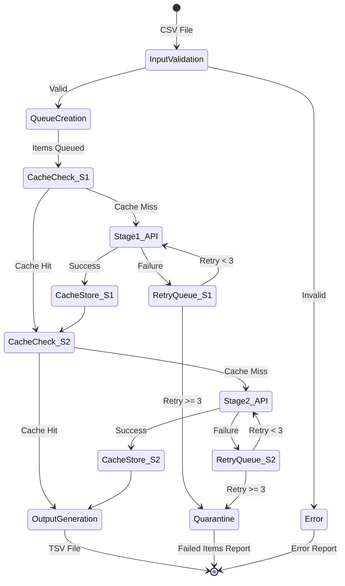

# Pipeline Design

**Last Updated**: 2025-01-07

## Purpose

This document details the complete two-stage processing pipeline that transforms Korean vocabulary items into Anki-compatible flashcards using AI-powered semantic analysis and generation.

## Pipeline Overview



## Stage 1: Semantic Analysis Pipeline

### Input Processing

```rust
pub struct Stage1Pipeline {
    cache_manager: CacheManager,
    api_client: PythonBridge,
    queue_manager: QueueManager,
}

impl Stage1Pipeline {
    pub async fn process_item(&self, item: &VocabularyItem) -> Result<Stage1Result> {
        // 1. Generate cache key
        let cache_key = generate_stage1_cache_key(item);
        
        // 2. Check cache
        if let Some(cached) = self.cache_manager.get_stage1(&cache_key).await? {
            metrics::increment_counter!("cache.hits.stage1");
            return Ok(cached);
        }
        
        metrics::increment_counter!("cache.misses.stage1");
        
        // 3. Update queue status
        self.queue_manager.update_status(
            item.position, 
            ProcessingStatus::Processing { stage: 1 }
        ).await?;
        
        // 4. Call API with retry logic
        let result = self.call_api_with_retry(item).await?;
        
        // 5. Store in cache
        self.cache_manager.store_stage1(&cache_key, &result).await?;
        
        // 6. Update queue status
        self.queue_manager.update_status(
            item.position,
            ProcessingStatus::CompletedStage1
        ).await?;
        
        Ok(result)
    }
    
    async fn call_api_with_retry(&self, item: &VocabularyItem) -> Result<Stage1Result> {
        let mut attempts = 0;
        let max_attempts = 3;
        
        loop {
            match self.api_client.process_stage1(item).await {
                Ok(result) => return Ok(result),
                Err(e) if attempts < max_attempts => {
                    attempts += 1;
                    let delay = calculate_backoff(attempts);
                    
                    warn!(
                        "Stage 1 API call failed for {}: {:?}. Retry {} after {}ms",
                        item.term, e, attempts, delay
                    );
                    
                    tokio::time::sleep(Duration::from_millis(delay)).await;
                }
                Err(e) => {
                    self.queue_manager.mark_failed(
                        item.position,
                        1,
                        &e.to_string()
                    ).await?;
                    return Err(e);
                }
            }
        }
    }
}
```

### Stage 1 Data Flow

```
Input: VocabularyItem {
    position: 1,
    term: "안녕하세요",
    word_type: Some("interjection")
}
              ↓
    [Cache Key Generation]
    SHA256("안녕하세요:interjection") = "a3f2b9..."
              ↓
    [Cache Lookup in SQLite]
              ↓
    [API Call if Cache Miss]
              ↓
Output: Stage1Result {
    term_number: 1,
    term: "안녕하세요",
    ipa: "[an.njʌŋ.ha.se.jo]",
    pos: "interjection",
    primary_meaning: "Hello (formal)",
    metaphor: "A warm bow of greeting",
    ...
}
```

## Stage 2: Flashcard Generation Pipeline

### Processing Flow

```rust
pub struct Stage2Pipeline {
    cache_manager: CacheManager,
    api_client: PythonBridge,
    queue_manager: QueueManager,
}

impl Stage2Pipeline {
    pub async fn process_item(
        &self, 
        item: &VocabularyItem,
        stage1_result: &Stage1Result
    ) -> Result<String> {
        // 1. Generate cache key (includes stage1 result)
        let cache_key = generate_stage2_cache_key(item, stage1_result);
        
        // 2. Check cache
        if let Some(cached) = self.cache_manager.get_stage2(&cache_key).await? {
            metrics::increment_counter!("cache.hits.stage2");
            return Ok(cached);
        }
        
        metrics::increment_counter!("cache.misses.stage2");
        
        // 3. Update queue status
        self.queue_manager.update_status(
            item.position,
            ProcessingStatus::Processing { stage: 2 }
        ).await?;
        
        // 4. Call API with retry logic
        let tsv_result = self.call_api_with_retry(item, stage1_result).await?;
        
        // 5. Validate TSV format
        self.validate_tsv_output(&tsv_result)?;
        
        // 6. Store in cache
        self.cache_manager.store_stage2(&cache_key, &tsv_result).await?;
        
        // 7. Update queue status
        self.queue_manager.update_status(
            item.position,
            ProcessingStatus::Completed
        ).await?;
        
        Ok(tsv_result)
    }
    
    fn validate_tsv_output(&self, tsv: &str) -> Result<()> {
        let lines: Vec<&str> = tsv.lines().collect();
        
        // Should have at least header + 3 cards
        if lines.len() < 4 {
            return Err(PipelineError::InvalidOutput(
                "TSV must have header and at least 3 cards".to_string()
            ));
        }
        
        // Validate header
        let expected_header = "position\tterm\tterm_number\ttab_name\tprimer\tfront\tback\ttags\thonorific_level";
        if lines[0] != expected_header {
            return Err(PipelineError::InvalidOutput(
                "Invalid TSV header".to_string()
            ));
        }
        
        // Validate each card has correct number of fields
        for (i, line) in lines.iter().skip(1).enumerate() {
            let fields: Vec<&str> = line.split('\t').collect();
            if fields.len() != 9 {
                return Err(PipelineError::InvalidOutput(
                    format!("Card {} has {} fields, expected 9", i + 1, fields.len())
                ));
            }
        }
        
        Ok(())
    }
}
```

### Stage 2 Output Format

```
position	term	term_number	tab_name	primer	front	back	tags	honorific_level
1	안녕하세요[an.njʌŋ.ha.se.jo]	1	Scene	You enter your clean...	Stepping through...	A warm bow...	term:안녕하세요,pos:interjection,card:Scene	
1	안녕하세요[an.njʌŋ.ha.se.jo]	1	Usage-Comparison	You enter your clean...	The bow from...	In formal settings...	term:안녕하세요,pos:interjection,card:Usage-Comparison	
1	안녕하세요[an.njʌŋ.ha.se.jo]	1	Hanja	You enter your clean...	The characters...	安寧 means peaceful...	term:안녕하세요,pos:interjection,card:Hanja	
```

## Complete Pipeline Orchestration

### Main Pipeline Controller

```rust
pub struct PipelineController {
    stage1: Stage1Pipeline,
    stage2: Stage2Pipeline,
    progress_tracker: ProgressTracker,
    output_writer: TsvWriter,
}

impl PipelineController {
    pub async fn process_csv(&self, input_path: &Path, output_path: &Path) -> Result<PipelineReport> {
        // 1. Parse and validate input
        let items = self.parse_csv(input_path).await?;
        info!("Loaded {} vocabulary items", items.len());
        
        // 2. Initialize progress tracking
        self.progress_tracker.init(items.len()).await?;
        
        // 3. Create processing queue
        let batch_id = Uuid::new_v4().to_string();
        self.create_processing_queue(&items, &batch_id).await?;
        
        // 4. Process items
        let mut results = Vec::new();
        let mut failed_items = Vec::new();
        
        for item in &items {
            match self.process_single_item(item).await {
                Ok(tsv_lines) => results.push(tsv_lines),
                Err(e) => {
                    error!("Failed to process {}: {:?}", item.term, e);
                    failed_items.push(FailedItem {
                        position: item.position,
                        term: item.term.clone(),
                        error: e.to_string(),
                    });
                }
            }
            
            self.progress_tracker.increment().await?;
        }
        
        // 5. Write output
        self.output_writer.write_tsv(output_path, &results).await?;
        
        // 6. Generate report
        let report = PipelineReport {
            batch_id,
            total_items: items.len(),
            successful: results.len(),
            failed: failed_items.len(),
            cache_hits_stage1: self.get_metric("cache.hits.stage1"),
            cache_hits_stage2: self.get_metric("cache.hits.stage2"),
            processing_time: self.progress_tracker.elapsed(),
            failed_items,
        };
        
        Ok(report)
    }
    
    async fn process_single_item(&self, item: &VocabularyItem) -> Result<String> {
        // Stage 1: Semantic Analysis
        let stage1_result = self.stage1.process_item(item).await?;
        
        // Stage 2: Flashcard Generation
        let tsv_output = self.stage2.process_item(item, &stage1_result).await?;
        
        Ok(tsv_output)
    }
}
```

## Queue Management

### Queue States

```rust
#[derive(Debug, Clone, Serialize, Deserialize)]
pub enum QueueState {
    Pending,
    Processing { stage: u8, started_at: DateTime<Utc> },
    CompletedStage1 { completed_at: DateTime<Utc> },
    Completed { completed_at: DateTime<Utc> },
    Failed { 
        stage: u8, 
        error: String, 
        failed_at: DateTime<Utc>,
        retry_count: u8 
    },
    Quarantined { reason: String },
}

pub struct QueueManager {
    db_pool: SqlitePool,
}

impl QueueManager {
    pub async fn create_batch(&self, items: &[VocabularyItem], batch_id: &str) -> Result<()> {
        let mut tx = self.db_pool.begin().await?;
        
        for item in items {
            sqlx::query!(
                r#"
                INSERT INTO processing_queue (vocabulary_id, batch_id, position, status, priority)
                SELECT id, ?, ?, 'pending', 5
                FROM vocabulary_items
                WHERE term = ? AND position = ?
                "#,
                batch_id,
                item.position,
                item.term,
                item.position
            )
            .execute(&mut tx)
            .await?;
        }
        
        tx.commit().await?;
        Ok(())
    }
    
    pub async fn get_pending_items(&self, limit: usize) -> Result<Vec<QueuedItem>> {
        let items = sqlx::query_as!(
            QueuedItem,
            r#"
            SELECT q.id, q.position, v.term, v.word_type
            FROM processing_queue q
            JOIN vocabulary_items v ON q.vocabulary_id = v.id
            WHERE q.status = 'pending'
            ORDER BY q.priority DESC, q.created_at ASC
            LIMIT ?
            "#,
            limit as i64
        )
        .fetch_all(&self.db_pool)
        .await?;
        
        Ok(items)
    }
}
```

## Error Recovery

### Checkpoint System

```rust
pub struct CheckpointManager {
    db_pool: SqlitePool,
}

impl CheckpointManager {
    pub async fn save_checkpoint(&self, state: &PipelineState) -> Result<()> {
        let json = serde_json::to_string(state)?;
        
        sqlx::query!(
            r#"
            INSERT OR REPLACE INTO checkpoints (batch_id, state_json, created_at)
            VALUES (?, ?, CURRENT_TIMESTAMP)
            "#,
            state.batch_id,
            json
        )
        .execute(&self.db_pool)
        .await?;
        
        Ok(())
    }
    
    pub async fn load_checkpoint(&self, batch_id: &str) -> Result<Option<PipelineState>> {
        let row = sqlx::query!(
            r#"
            SELECT state_json FROM checkpoints
            WHERE batch_id = ?
            ORDER BY created_at DESC
            LIMIT 1
            "#,
            batch_id
        )
        .fetch_optional(&self.db_pool)
        .await?;
        
        match row {
            Some(r) => Ok(Some(serde_json::from_str(&r.state_json)?)),
            None => Ok(None),
        }
    }
}

#[derive(Serialize, Deserialize)]
pub struct PipelineState {
    pub batch_id: String,
    pub total_items: usize,
    pub processed_items: usize,
    pub last_processed_position: Option<i32>,
    pub failed_positions: Vec<i32>,
}
```

### Resume Capability

```rust
impl PipelineController {
    pub async fn resume_batch(&self, batch_id: &str, output_path: &Path) -> Result<PipelineReport> {
        // 1. Load checkpoint
        let checkpoint = self.checkpoint_manager.load_checkpoint(batch_id).await?
            .ok_or_else(|| PipelineError::NoCheckpoint(batch_id.to_string()))?;
        
        info!(
            "Resuming batch {} from position {} ({}/{})",
            batch_id,
            checkpoint.last_processed_position.unwrap_or(0),
            checkpoint.processed_items,
            checkpoint.total_items
        );
        
        // 2. Get remaining items
        let remaining_items = self.get_unprocessed_items(batch_id, checkpoint.last_processed_position).await?;
        
        // 3. Process remaining items
        self.progress_tracker.init_resume(
            checkpoint.processed_items,
            checkpoint.total_items
        ).await?;
        
        // Continue processing...
        self.process_items(remaining_items, Some(checkpoint)).await
    }
}
```

## Progress Tracking

### Real-time Progress Updates

```rust
use indicatif::{ProgressBar, ProgressStyle};

pub struct ProgressTracker {
    bar: ProgressBar,
    start_time: Instant,
    processed: AtomicUsize,
}

impl ProgressTracker {
    pub fn new(total: usize) -> Self {
        let bar = ProgressBar::new(total as u64);
        bar.set_style(
            ProgressStyle::default_bar()
                .template("[{elapsed_precise}] {bar:40.cyan/blue} {pos}/{len} ({percent}%) {msg}")
                .progress_chars("##-")
        );
        
        Self {
            bar,
            start_time: Instant::now(),
            processed: AtomicUsize::new(0),
        }
    }
    
    pub async fn update(&self, position: i32, status: &str) {
        let processed = self.processed.fetch_add(1, Ordering::Relaxed) + 1;
        let rate = processed as f64 / self.start_time.elapsed().as_secs_f64();
        
        self.bar.inc(1);
        self.bar.set_message(format!(
            "Processing #{}: {} ({:.1} items/sec)",
            position, status, rate
        ));
    }
}
```

## Output Generation

### TSV Writer

```rust
pub struct TsvWriter {
    buffer_size: usize,
}

impl TsvWriter {
    pub async fn write_tsv(&self, path: &Path, results: &[String]) -> Result<()> {
        let mut file = BufWriter::with_capacity(
            self.buffer_size,
            File::create(path).await?
        );
        
        // Write header
        file.write_all(b"position\tterm\tterm_number\ttab_name\tprimer\tfront\tback\ttags\thonorific_level\n").await?;
        
        // Write cards
        for result in results {
            // Skip header line from each result
            let lines: Vec<&str> = result.lines().skip(1).collect();
            for line in lines {
                file.write_all(line.as_bytes()).await?;
                file.write_all(b"\n").await?;
            }
        }
        
        file.flush().await?;
        Ok(())
    }
}
```

## Performance Optimization

### Batch Processing Strategy

```rust
const OPTIMAL_BATCH_SIZE: usize = 50;
const MAX_CONCURRENT_REQUESTS: usize = 10;

impl PipelineController {
    pub async fn process_batch_optimized(&self, items: Vec<VocabularyItem>) -> Result<Vec<String>> {
        let semaphore = Arc::new(Semaphore::new(MAX_CONCURRENT_REQUESTS));
        let chunks: Vec<_> = items.chunks(OPTIMAL_BATCH_SIZE).collect();
        
        let mut all_results = Vec::new();
        
        for chunk in chunks {
            let futures: Vec<_> = chunk
                .iter()
                .map(|item| {
                    let sem = semaphore.clone();
                    let item = item.clone();
                    
                    async move {
                        let _permit = sem.acquire().await.unwrap();
                        self.process_single_item(&item).await
                    }
                })
                .collect();
            
            let results = futures::future::join_all(futures).await;
            
            for result in results {
                match result {
                    Ok(tsv) => all_results.push(tsv),
                    Err(e) => error!("Batch processing error: {:?}", e),
                }
            }
            
            // Save checkpoint after each batch
            self.save_batch_checkpoint(&chunk).await?;
        }
        
        Ok(all_results)
    }
}
```

## Monitoring and Metrics

### Pipeline Metrics

```rust
pub struct PipelineMetrics {
    pub items_processed: Counter,
    pub items_failed: Counter,
    pub api_calls_stage1: Counter,
    pub api_calls_stage2: Counter,
    pub cache_hits_stage1: Counter,
    pub cache_hits_stage2: Counter,
    pub processing_time: Histogram,
    pub queue_depth: Gauge,
}

impl PipelineMetrics {
    pub fn record_item_processed(&self, duration: Duration) {
        self.items_processed.increment(1);
        self.processing_time.record(duration);
    }
    
    pub fn record_cache_hit(&self, stage: u8) {
        match stage {
            1 => self.cache_hits_stage1.increment(1),
            2 => self.cache_hits_stage2.increment(1),
            _ => {}
        }
    }
}
```

## Complete Processing Example

```bash
# Initial run
$ flashcard-cli process vocab_lesson1.csv output_lesson1.tsv
[00:00:15] ████████████████████ 500/500 (100%) Processing #500: 완료 (33.3 items/sec)

✅ Pipeline completed successfully!
- Total items: 500
- Successful: 498
- Failed: 2
- Cache hit rate: 45% (Stage 1), 12% (Stage 2)
- Processing time: 15.0s
- Output written to: output_lesson1.tsv

⚠️  2 items failed and were quarantined. Run 'flashcard-cli show-failed' for details.

# Resume after interruption
$ flashcard-cli resume --batch-id abc123 output_lesson1.tsv
[00:00:05] ████████░░░░░░░░░░░░ 342/500 (68%) Resuming from position 342...
```