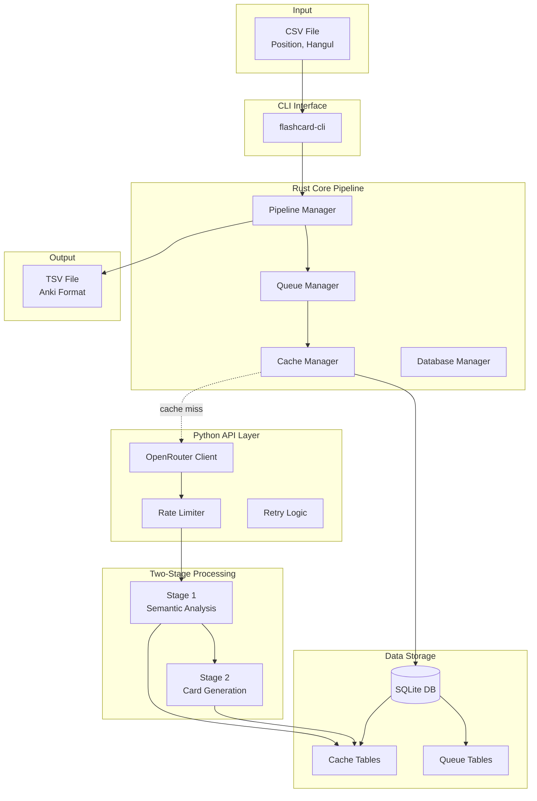

# System Design

**Last Updated**: 2025-01-07

## Purpose

This document provides the comprehensive system architecture for the Korean Language Flashcard Pipeline, designed to process vocabulary items through a two-stage AI pipeline to generate high-quality Anki-compatible flashcards.

## System Overview



## Architecture Principles

### 1. Separation of Concerns
- **Rust**: Performance-critical operations (file I/O, database, pipeline orchestration)
- **Python**: API interactions (HTTP client, JSON handling, rate limiting)
- **SQLite**: Data persistence and caching

### 2. Fault Tolerance
- Every operation can be resumed from last successful state
- Failed items quarantined for manual inspection
- Comprehensive error logging and reporting

### 3. Cost Optimization
- Permanent caching of all API responses
- Cache-first architecture minimizes API calls
- Intelligent retry logic prevents wasteful retries

### 4. Scalability
- Batch processing supports 500+ items
- Async/concurrent processing where beneficial
- Database indexes optimized for common queries

## Component Architecture

### 1. CLI Interface (Rust)

```rust
// Primary commands
flashcard-cli process <input.csv> <output.tsv>
flashcard-cli status [--detailed]
flashcard-cli retry [--batch-id <id>]
flashcard-cli cache stats
```

**Responsibilities:**
- Parse command-line arguments
- Validate input files
- Display progress and results
- Handle user interruptions gracefully

### 2. Pipeline Manager (Rust)

```rust
pub struct PipelineManager {
    queue_manager: QueueManager,
    cache_manager: CacheManager,
    api_bridge: PythonApiBridge,
    config: PipelineConfig,
}
```

**Responsibilities:**
- Orchestrate the two-stage processing flow
- Manage batch operations
- Track processing state
- Generate final TSV output

### 3. Cache Manager (Rust)

```rust
pub struct CacheManager {
    db_pool: SqlitePool,
    stage1_cache: Stage1Cache,
    stage2_cache: Stage2Cache,
}
```

**Responsibilities:**
- Check cache before API calls
- Store API responses permanently
- Provide cache statistics
- Handle cache queries efficiently

### 4. OpenRouter Client (Python)

```python
class OpenRouterClient:
    def __init__(self, api_key: str, model: str = "claude-3-sonnet"):
        self.api_key = api_key
        self.model = model
        self.rate_limiter = RateLimiter()
        self.session = httpx.AsyncClient(http2=True)
```

**Responsibilities:**
- Manage API authentication
- Format requests for Claude Sonnet 4
- Handle HTTP communication
- Parse API responses

### 5. Rate Limiter (Python)

```python
class RateLimiter:
    def __init__(self, requests_per_minute: int = 60):
        self.rpm = requests_per_minute
        self.token_bucket = TokenBucket()
```

**Responsibilities:**
- Implement token bucket algorithm
- Prevent API rate limit violations
- Queue requests when at capacity
- Provide wait time estimates

## Data Flow

### Stage 1: Semantic Analysis

```
Input: {position: 1, hangul: "안녕하세요"}
                    ↓
         Check Stage1 Cache
                    ↓
    [Cache Hit] ←---+---→ [Cache Miss]
         ↓                      ↓
    Return Cached         Call OpenRouter API
                                ↓
                          Store in Cache
                                ↓
Output: {
    "term": "안녕하세요",
    "ipa": "[an.njʌŋ.ha.se.jo]",
    "pos": "interjection",
    "primary_meaning": "Hello (formal)",
    "metaphor": "A warm bow of greeting",
    ...
}
```

### Stage 2: Card Generation

```
Input: Stage1 Result + Original Item
                    ↓
         Check Stage2 Cache
                    ↓
    [Cache Hit] ←---+---→ [Cache Miss]
         ↓                      ↓
    Return Cached         Call OpenRouter API
                                ↓
                          Generate 3 Cards:
                          - Scene Card
                          - Usage Card
                          - Hanja Card
                                ↓
                          Store in Cache
                                ↓
Output: TSV-formatted flashcard data
```

## Database Design Summary

### Core Tables
1. **vocabulary_items** - Source vocabulary tracking
2. **stage1_cache** - Semantic analysis results (permanent)
3. **stage2_cache** - Generated flashcards (permanent)
4. **processing_queue** - Items awaiting processing
5. **failed_items** - Quarantined failures
6. **api_requests** - Request/response logging
7. **performance_metrics** - System performance data
8. **cache_metadata** - Cache statistics

### Key Design Decisions
- **Permanent Caching**: No TTL on cache entries
- **Content-based Keys**: Hash of input for cache lookup
- **Failed Item Quarantine**: Separate table for failures
- **Atomic Operations**: All DB writes in transactions

## API Integration Design

### Request Format
```python
{
    "model": "anthropic/claude-3-sonnet",
    "messages": [
        {
            "role": "system",
            "content": STAGE1_PRESET or STAGE2_PRESET
        },
        {
            "role": "user",
            "content": vocabulary_item_json
        }
    ],
    "temperature": 0.7,
    "max_tokens": 2000
}
```

### Error Handling Strategy
1. **Retry Logic**: 3 attempts with exponential backoff
2. **Error Types**:
   - Transient (retry): Network, rate limit, 5xx
   - Permanent (quarantine): 4xx, parsing errors
3. **Backoff Formula**: `delay = min(2^attempt * 1000ms, 30000ms)`

## Security Considerations

### API Key Management
- Stored in `.env` file (never in code)
- Loaded via environment variables
- Validated on startup

### Data Security
- No PII stored in logs
- Sanitized error messages
- Local SQLite file with OS permissions

### Input Validation
- CSV format validation
- UTF-8 encoding verification
- Size limits on input files

## Performance Optimization

### Concurrency Model
```rust
// Rust: Process batches concurrently
let futures: Vec<_> = batch
    .chunks(10)
    .map(|chunk| process_chunk(chunk))
    .collect();

let results = futures::future::join_all(futures).await;
```

### Database Optimization
- Prepared statements for repeated queries
- Connection pooling (5-20 connections)
- Memory-mapped I/O for cache tables
- Indexes on all lookup columns

### Memory Management
- Stream large files instead of loading fully
- Process in configurable batch sizes
- Clear processed items from memory

## Error Recovery

### Checkpoint System
```rust
pub struct ProcessingCheckpoint {
    batch_id: String,
    total_items: usize,
    processed_items: usize,
    failed_items: Vec<FailedItem>,
    last_processed_position: i32,
}
```

### Resume Capability
- Save checkpoint every 50 items
- On restart, load last checkpoint
- Skip already processed items
- Retry failed items separately

## Monitoring & Observability

### Metrics Tracked
1. **Performance**
   - Items processed per minute
   - API response times
   - Cache hit rates
   - Database query times

2. **Reliability**
   - Error rates by type
   - Retry success rates
   - Queue depths
   - Failed item counts

3. **Cost**
   - API calls made
   - Tokens consumed
   - Cache savings

### Logging Strategy
```
[2025-01-07 10:30:45] INFO  Pipeline started: batch_id=abc123, items=500
[2025-01-07 10:30:46] DEBUG Cache hit: item=안녕하세요, stage=1
[2025-01-07 10:30:47] WARN  API retry: attempt=2, error=rate_limit
[2025-01-07 10:31:15] ERROR Failed item: position=42, error=parse_error
```

## Future Architecture Considerations

### Horizontal Scaling
- Multiple worker processes
- Distributed cache (Redis)
- Queue service (RabbitMQ)

### API Abstraction
- Support multiple AI providers
- Model selection strategies
- A/B testing framework

### Advanced Features
- Real-time processing mode
- Webhook notifications
- GraphQL API layer

## Implementation Dependencies

### Rust Dependencies
- tokio - Async runtime
- sqlx - Database access
- serde - Serialization
- clap - CLI parsing
- indicatif - Progress bars

### Python Dependencies
- httpx - HTTP client
- pydantic - Data validation
- asyncio - Async support
- python-dotenv - Environment management

## Development Workflow

1. **Local Development**
   ```bash
   # Terminal 1: Run Rust pipeline
   cargo run -- process test.csv output.tsv
   
   # Terminal 2: Run Python API service
   python -m flashcard_pipeline.api_service
   ```

2. **Testing Strategy**
   - Unit tests for each component
   - Integration tests with mock API
   - End-to-end tests with sample data

3. **Deployment**
   - Single binary distribution
   - Embedded Python runtime
   - Installer with dependencies