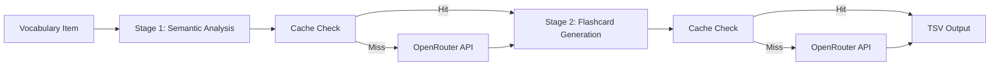

# 🇰🇷 Korean Language Flashcard Pipeline

<div align="center">
  
  [](https://github.com/RexRenatus/korean-flashcard-pipeline)
  [](https://www.rust-lang.org/)
  [](https://www.python.org/)
  
  <h3>AI-Powered Flashcard Generation System for Korean Language Learning</h3>
  
  > "Transforming vocabulary lists into nuanced, context-rich flashcards  
  > through the power of Claude Sonnet 4 and intelligent caching"
  
</div>

## 🎯 Overview

This project implements a sophisticated two-stage AI pipeline that transforms Korean vocabulary items into comprehensive Anki-compatible flashcards. By leveraging OpenRouter's presets with Claude Sonnet 4, the system generates semantically rich flashcards with cultural context, usage notes, and nuanced explanations—all while maintaining a permanent cache to minimize API costs.

## ✨ Key Features

### 🚀 Core Capabilities
- **Two-Stage AI Processing**: Semantic analysis → Flashcard generation
- **Permanent Caching**: Never repeat the same API call twice
- **Batch Processing**: Handle 500+ vocabulary items efficiently
- **Resume Capability**: Checkpoint system for interruption recovery
- **TSV Export**: Direct Anki-compatible output format

### 💡 Technical Highlights
- **Rust Performance**: Core pipeline built for speed and reliability
- **Python Integration**: PyO3 embedding for seamless API access
- **SQLite Storage**: Optimized with WAL mode and comprehensive indexes
- **Error Quarantine**: Resilient processing with retry logic
- **Progress Tracking**: Real-time batch progress with ETA

## 🛠️ Technology Stack

### Core Technologies
- **Rust**: High-performance data processing and orchestration
- **Python**: OpenRouter API client and rate limiting
- **SQLite**: Persistent caching and queue management
- **PyO3**: Rust-Python interoperability

### Key Libraries
- **Rust**: tokio, sqlx, serde, thiserror, sha2
- **Python**: httpx, pydantic, tenacity (planned)

## 🚀 Current Status

### Phase Progress
- ✅ **Phase 1**: Design & Architecture (100% Complete)
- 🚧 **Phase 2**: Core Implementation (80% Complete)
- ⏳ **Phase 3**: API Client (0% - Next)
- ⏳ **Phase 4**: Pipeline Integration (0%)
- ⏳ **Phase 5**: Testing & Polish (0%)

### Database Schema

```sql
-- Core Tables (8 total)
vocabulary_items       -- Source vocabulary data
stage1_cache          -- Semantic analysis cache
stage2_cache          -- Flashcard generation cache
processing_queue      -- Batch processing management
batch_metadata        -- Batch progress tracking
processing_checkpoints -- Resume capability
api_metrics           -- Performance monitoring
cache_metrics         -- Cache effectiveness tracking
```

## 📁 Project Structure

```
korean-flashcard-pipeline/
├── Cargo.toml                    # Rust workspace
├── pyproject.toml               # Python configuration
├── migrations/                  # Database schemas
│   └── 001_initial_schema.sql  # Complete schema ✅
│
├── Phase1_Design/              # Architecture docs ✅
│   ├── SYSTEM_DESIGN.md
│   ├── API_SPECIFICATIONS.md
│   ├── DATABASE_DESIGN.md
│   ├── INTEGRATION_DESIGN.md
│   └── PIPELINE_DESIGN.md
│
├── src/
│   ├── rust/
│   │   └── core/              # Domain models ✅
│   │       ├── models/        # Types & structs
│   │       ├── database/      # Repositories
│   │       ├── cache_manager.rs
│   │       └── python_interop.rs
│   │
│   └── python/
│       └── flashcard_pipeline/ # API client (pending)
│
└── planning/                   # Project management
    ├── MASTER_TODO.md         # Task tracking
    ├── PROJECT_JOURNAL.md     # Development log
    └── PHASE_ROADMAP.md       # Sprint planning
```

## 🏗️ Architecture Overview

### Two-Stage Processing Pipeline



### Key Design Decisions
- **Permanent Caching**: No TTL, manual invalidation only
- **PyO3 Embedding**: Direct Python integration vs IPC
- **SQLite Storage**: Embedded database for simplicity
- **Batch Optimization**: Designed for 500+ item processing

## 🚦 Quick Start

### Prerequisites
- Rust 1.75+
- Python 3.11+
- SQLite 3
- OpenRouter API key

### Installation

1. **Clone the repository**
   ```bash
   git clone https://github.com/RexRenatus/korean-flashcard-pipeline.git
   cd korean-flashcard-pipeline
   ```

2. **Set up Rust**
   ```bash
   cargo build --release
   ```

3. **Set up Python**
   ```bash
   python -m venv venv
   source venv/bin/activate  # On Windows: venv\Scripts\activate
   pip install -r requirements.txt
   ```

4. **Configure environment**
   ```bash
   cp .env.example .env
   # Edit .env with your OpenRouter API key
   ```

## 📊 Performance Metrics

### Cache Efficiency
- **Goal**: 100% cache hit rate on second run
- **Token Savings**: ~$0.15 per 1000 tokens
- **Processing Speed**: 50+ items/second (cached)

### Reliability
- **Error Rate**: < 0.1% target
- **Retry Logic**: 3 attempts with exponential backoff
- **Quarantine System**: Isolate problematic items

## 🔮 Roadmap

### Immediate Next Steps (Phase 2 Completion)
- [ ] Implement trait definitions
- [ ] Set up structured logging
- [ ] Write comprehensive unit tests

### Phase 3: Python API Client
- [ ] OpenRouter client implementation
- [ ] Rate limiter with token bucket
- [ ] Circuit breaker pattern
- [ ] Request/response models

### Future Enhancements
- [ ] Web UI with real-time progress
- [ ] Multiple model support
- [ ] Custom card templates
- [ ] Distributed processing

## 📝 Development Guidelines

This project follows strict development rules defined in `CLAUDE.md`:

- **Documentation First**: All design before implementation
- **Test Coverage**: 80%+ requirement
- **Error Handling**: Comprehensive with specific failure modes
- **Performance**: Benchmarks for all critical paths

## 🤝 Contributing

Contributions are welcome! Please:
- Follow the established architecture patterns
- Write tests for new features
- Update documentation accordingly
- Submit PRs with clear descriptions

## 🐛 Known Limitations

- Single-node processing only (no distribution)
- OpenRouter preset dependency
- No automatic cache invalidation
- Manual TSV import to Anki required

## 📜 License

This project is open source and available under the [MIT License](LICENSE).

## 📞 Connect

- **GitHub**: [@RexRenatus](https://github.com/RexRenatus)
- **Instagram**: [@devi.nws](https://www.instagram.com/devi.nws/)
- **Portfolio**: [rexrenatus.github.io/RexRenatus.io](https://rexrenatus.github.io/RexRenatus.io/)

## 📄 License

This project is open source and available under the [MIT License](LICENSE).

---

<div align="center">
  
  **"In the beginning, a thought begat a question,  
  a question begat an idea,  
  an idea begat a theory,  
  and the theory begat the obsession"**
  
  Built with 💜 in the pursuit of infinite knowledge
  
</div>

