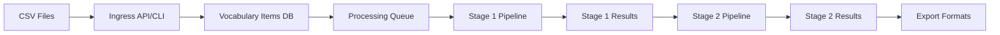

# Ingress Feature Architecture

## Overview

The Ingress Feature transforms the Korean Flashcard Pipeline from a file-based system to a database-driven architecture. This enables better data management, queuing, and processing control.

## Architecture Design

### 1. Data Flow



### 2. Database Schema Additions

#### vocabulary_items table (already designed in Phase 1)
```sql
CREATE TABLE vocabulary_items (
    id INTEGER PRIMARY KEY AUTOINCREMENT,
    korean TEXT NOT NULL UNIQUE,
    english TEXT NOT NULL,
    type TEXT NOT NULL CHECK (type IN ('word', 'phrase', 'idiom', 'grammar')),
    source_file TEXT,
    import_batch_id TEXT,
    status TEXT DEFAULT 'pending' CHECK (status IN ('pending', 'processing', 'completed', 'failed')),
    created_at TIMESTAMP DEFAULT CURRENT_TIMESTAMP,
    updated_at TIMESTAMP DEFAULT CURRENT_TIMESTAMP
);

CREATE INDEX idx_vocabulary_status ON vocabulary_items(status);
CREATE INDEX idx_vocabulary_batch ON vocabulary_items(import_batch_id);
```

#### import_batches table (new)
```sql
CREATE TABLE import_batches (
    id TEXT PRIMARY KEY,
    source_file TEXT NOT NULL,
    total_items INTEGER NOT NULL,
    processed_items INTEGER DEFAULT 0,
    status TEXT DEFAULT 'pending' CHECK (status IN ('pending', 'processing', 'completed', 'failed')),
    created_at TIMESTAMP DEFAULT CURRENT_TIMESTAMP,
    completed_at TIMESTAMP
);
```

### 3. Ingress API Design

#### CLI Commands
```bash
# Import CSV to database
flashcard-pipeline ingress import <csv_file> [--batch-id <id>]

# List import batches
flashcard-pipeline ingress list-batches [--status <status>]

# Process items from database
flashcard-pipeline process --source database [--batch-id <id>] [--limit <n>]

# Check import status
flashcard-pipeline ingress status <batch_id>
```

#### Python Implementation Structure
```python
# src/python/flashcard_pipeline/ingress.py
class IngressService:
    def import_csv(self, file_path: str, batch_id: Optional[str] = None) -> str:
        """Import CSV file to vocabulary_items table"""
        
    def get_pending_items(self, limit: int = 100, batch_id: Optional[str] = None) -> List[VocabularyItem]:
        """Retrieve pending items from database"""
        
    def update_item_status(self, item_id: int, status: str) -> None:
        """Update processing status of an item"""
        
    def get_batch_status(self, batch_id: str) -> Dict:
        """Get status of an import batch"""
```

### 4. Modified Pipeline Flow

```python
# src/python/flashcard_pipeline/pipeline.py modifications
class Pipeline:
    def process_from_database(self, batch_id: Optional[str] = None, limit: int = 100):
        """Process items directly from database"""
        # 1. Fetch pending items from vocabulary_items
        # 2. Update status to 'processing'
        # 3. Process through Stage 1 and Stage 2
        # 4. Update status to 'completed' or 'failed'
        # 5. Update batch progress
```

### 5. Migration Strategy

1. **Phase 1: Database Setup**
   - Create new tables (vocabulary_items, import_batches)
   - Add database migration scripts

2. **Phase 2: Ingress Implementation**
   - Implement IngressService class
   - Add CLI commands for import operations
   - Create batch tracking functionality

3. **Phase 3: Pipeline Integration**
   - Modify pipeline to support database source
   - Implement status tracking
   - Add progress monitoring

4. **Phase 4: Backward Compatibility**
   - Keep CSV direct processing as fallback
   - Add `--source` flag to choose between csv/database

### 6. Configuration Updates

#### .env additions
```env
# Ingress Configuration
INGRESS_BATCH_SIZE=1000
INGRESS_AUTO_PROCESS=false
INGRESS_CLEANUP_DAYS=30
DATABASE_POOL_SIZE=5
```

### 7. Benefits

1. **Data Persistence**: All vocabulary items stored permanently
2. **Batch Processing**: Process large datasets in manageable chunks
3. **Status Tracking**: Know exactly which items have been processed
4. **Retry Capability**: Easy to reprocess failed items
5. **Analytics**: Track processing statistics over time
6. **Queue Management**: Better control over processing order and priority

### 8. Implementation Checklist

- [ ] Create database migration for new tables
- [ ] Implement IngressService class
- [ ] Add ingress CLI commands
- [ ] Modify Pipeline class for database source
- [ ] Update environment configuration
- [ ] Add batch tracking and monitoring
- [ ] Create integration tests
- [ ] Update documentation
- [ ] Add Docker support

## Next Steps

1. Review and approve this architecture
2. Implement database migrations
3. Create IngressService implementation
4. Update pipeline for database integration
5. Test with sample data
6. Create Docker configuration
