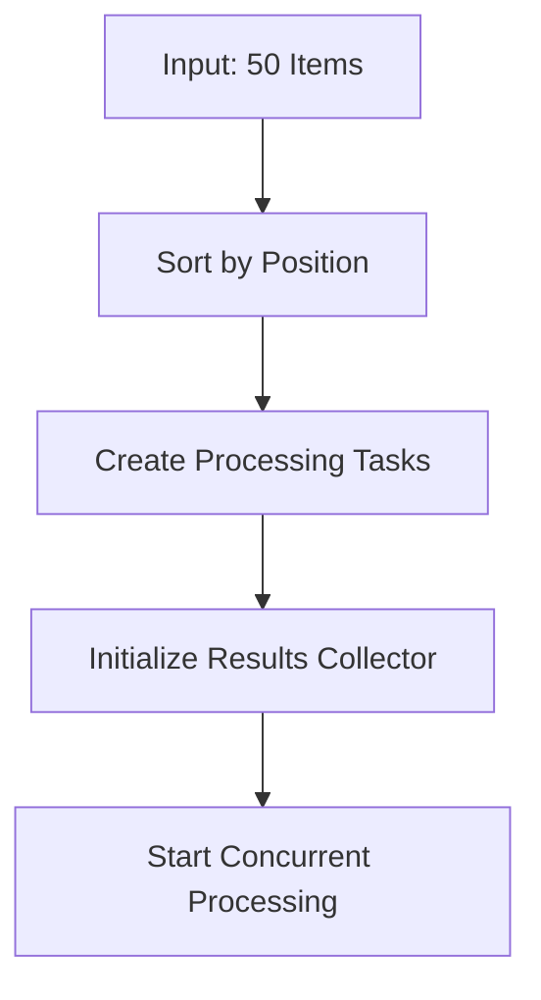

# Concurrent Processing Architecture

**Created**: 2025-01-07  
**Purpose**: Enable concurrent processing of 50 vocabulary items while maintaining order

## Overview

This architecture enables processing up to 50 vocabulary items concurrently through the OpenRouter API while ensuring:
- Order preservation in database and output files
- Effective rate limiting across concurrent requests
- Proper error handling and retry logic
- Cache efficiency
- Circuit breaker protection

## Key Design Principles

1. **Order Preservation**: Use item position as primary key for ordering
2. **Controlled Concurrency**: Semaphore-based concurrency limiting
3. **Graceful Degradation**: Fall back to smaller batches on failures
4. **Progress Tracking**: Real-time updates for all concurrent operations

## Architecture Components

### 1. Concurrent Pipeline Orchestrator

```python
class ConcurrentPipelineOrchestrator:
    def __init__(self, 
                 max_concurrent: int = 50,
                 rate_limit_buffer: float = 0.8):
        self.semaphore = asyncio.Semaphore(max_concurrent)
        self.rate_limiter = DistributedRateLimiter()
        self.circuit_breaker = CircuitBreaker()
        self.results_collector = OrderedResultsCollector()
```

### 2. Ordered Results Collector

```python
class OrderedResultsCollector:
    """Maintains order of results despite concurrent processing"""
    
    def __init__(self):
        self.results: Dict[int, ProcessingResult] = {}
        self.lock = asyncio.Lock()
    
    async def add_result(self, position: int, result: ProcessingResult):
        async with self.lock:
            self.results[position] = result
    
    def get_ordered_results(self) -> List[ProcessingResult]:
        return [self.results[i] for i in sorted(self.results.keys())]
```

### 3. Distributed Rate Limiter

```python
class DistributedRateLimiter:
    """Thread-safe rate limiter for concurrent requests"""
    
    def __init__(self, requests_per_minute: int = 600):
        self.tokens = asyncio.Queue(maxsize=requests_per_minute)
        self.refill_task = None
        
    async def acquire(self):
        """Block until a token is available"""
        token = await self.tokens.get()
        return token
```

## Processing Flow

### Stage 1: Batch Preparation



### Stage 2: Concurrent Processing

```python
async def process_batch_concurrent(items: List[VocabularyItem]) -> List[ProcessingResult]:
    orchestrator = ConcurrentPipelineOrchestrator(max_concurrent=50)
    
    # Create tasks for each item
    tasks = []
    for item in items:
        task = orchestrator.process_item_with_order(item)
        tasks.append(task)
    
    # Process concurrently
    results = await asyncio.gather(*tasks, return_exceptions=True)
    
    # Collect ordered results
    return orchestrator.results_collector.get_ordered_results()
```

### Stage 3: Database Writing

```python
async def write_to_database_ordered(results: List[ProcessingResult]):
    async with database.transaction():
        for result in results:
            await database.insert(
                position=result.position,
                term=result.term,
                flashcard_data=result.data,
                preserve_order=True
            )
```

## Implementation Details

### 1. Semaphore-Controlled Processing

```python
async def process_item_with_order(self, item: VocabularyItem):
    async with self.semaphore:  # Limit to 50 concurrent
        try:
            # Acquire rate limit token
            await self.rate_limiter.acquire()
            
            # Check circuit breaker
            if not self.circuit_breaker.is_open():
                result = await self._process_single_item(item)
                await self.results_collector.add_result(
                    item.position, result
                )
            else:
                # Queue for retry
                await self.retry_queue.put(item)
                
        except Exception as e:
            await self.handle_error(item, e)
```

### 2. Progress Tracking

```python
class ConcurrentProgressTracker:
    def __init__(self, total_items: int):
        self.total = total_items
        self.completed = 0
        self.failed = 0
        self.in_progress = set()
        self.lock = asyncio.Lock()
    
    async def update(self, item_id: int, status: str):
        async with self.lock:
            if status == "started":
                self.in_progress.add(item_id)
            elif status == "completed":
                self.in_progress.discard(item_id)
                self.completed += 1
            elif status == "failed":
                self.in_progress.discard(item_id)
                self.failed += 1
```

### 3. Cache Strategy

```python
class ConcurrentCacheService:
    """Thread-safe cache for concurrent access"""
    
    def __init__(self):
        self.cache = {}
        self.locks = defaultdict(asyncio.Lock)
    
    async def get_or_compute(self, key: str, compute_func):
        async with self.locks[key]:
            if key in self.cache:
                return self.cache[key]
            
            result = await compute_func()
            self.cache[key] = result
            return result
```

## Error Handling

### 1. Retry Strategy

```python
class ExponentialBackoffRetry:
    def __init__(self, max_retries: int = 3):
        self.max_retries = max_retries
        self.base_delay = 1.0
    
    async def retry(self, func, item: VocabularyItem):
        for attempt in range(self.max_retries):
            try:
                return await func(item)
            except Exception as e:
                if attempt == self.max_retries - 1:
                    raise
                delay = self.base_delay * (2 ** attempt)
                await asyncio.sleep(delay)
```

### 2. Partial Batch Recovery

```python
async def process_with_recovery(items: List[VocabularyItem]):
    """Process items with automatic batch size reduction on failures"""
    
    batch_size = 50
    while batch_size > 0:
        try:
            batches = [items[i:i+batch_size] 
                      for i in range(0, len(items), batch_size)]
            
            for batch in batches:
                await process_batch_concurrent(batch)
            break
            
        except RateLimitError:
            batch_size = max(1, batch_size // 2)
            logger.warning(f"Reducing batch size to {batch_size}")
```

## Database Schema Updates

```sql
-- Add indexes for efficient ordered retrieval
CREATE INDEX idx_flashcards_position ON flashcards(position);
CREATE INDEX idx_flashcards_batch_position ON flashcards(batch_id, position);

-- Add batch processing metadata
ALTER TABLE flashcards ADD COLUMN processing_timestamp TIMESTAMP;
ALTER TABLE flashcards ADD COLUMN processing_duration_ms INTEGER;
```

## Configuration

```python
# config.py
CONCURRENT_PROCESSING_CONFIG = {
    "max_concurrent_requests": 50,
    "rate_limit_buffer": 0.8,  # Use 80% of rate limit
    "semaphore_timeout": 30.0,
    "circuit_breaker_threshold": 10,
    "circuit_breaker_timeout": 60,
    "retry_max_attempts": 3,
    "retry_base_delay": 1.0,
    "batch_timeout": 300.0,  # 5 minutes per batch
}
```

## Monitoring and Metrics

```python
class ConcurrentProcessingMetrics:
    """Track metrics for concurrent processing"""
    
    def __init__(self):
        self.metrics = {
            "total_requests": 0,
            "concurrent_high_water_mark": 0,
            "average_response_time": 0.0,
            "rate_limit_hits": 0,
            "circuit_breaker_trips": 0,
            "retry_count": 0,
            "order_violations": 0
        }
```

## Testing Strategy

1. **Concurrency Tests**
   - Test with 50 concurrent requests
   - Verify order preservation
   - Test rate limit handling

2. **Failure Scenarios**
   - Partial batch failures
   - Circuit breaker activation
   - Rate limit exhaustion

3. **Performance Tests**
   - Measure throughput improvement
   - Monitor resource usage
   - Validate order consistency

## Migration Plan

1. **Phase 1**: Implement OrderedResultsCollector
2. **Phase 2**: Add concurrent processing with small batches (5-10)
3. **Phase 3**: Scale up to 50 concurrent with monitoring
4. **Phase 4**: Optimize based on performance data

## Benefits

1. **Performance**: ~50x faster processing for large batches
2. **Reliability**: Maintains order guarantees
3. **Scalability**: Easy to adjust concurrency level
4. **Monitoring**: Built-in metrics and progress tracking

## Risks and Mitigations

| Risk | Mitigation |
|------|------------|
| Rate limit exhaustion | Adaptive batch sizing |
| Memory pressure | Stream results to disk |
| Order corruption | Position-based sorting |
| API throttling | Circuit breaker pattern |

## Next Steps

1. Implement OrderedResultsCollector class
2. Update RateLimiter for concurrent access
3. Modify process_batch to use concurrent processing
4. Add comprehensive concurrent processing tests
5. Deploy with gradual concurrency increase