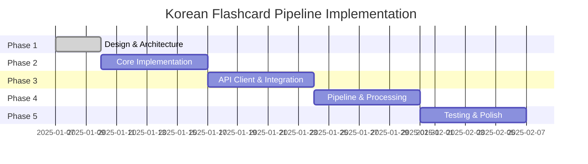

# Phase Roadmap

**Last Updated**: 2025-01-07

## Purpose

This document outlines the implementation phases for the Korean Language Flashcard Pipeline project, breaking down the MVP into manageable 1-week sprints with clear deliverables and success criteria.

## Project Timeline Overview

**MVP Target**: 4-6 weeks  
**Total Phases**: 5  
**Sprint Duration**: 1 week per phase

## Phase 1: Design & Architecture ✅ COMPLETE

**Duration**: 3 days (Completed)  
**Status**: ✅ 100% Complete

### Deliverables
- ✅ Project structure and configuration
- ✅ Complete design documentation
- ✅ Database schema with SOLID principles
- ✅ API specifications with exact contracts
- ✅ Integration strategy (PyO3 embedded)
- ✅ Pipeline design with error recovery

### Key Outcomes
- Clear technical direction established
- All architectural decisions documented
- Ready for implementation

---

## Phase 2: Core Implementation (Rust)

**Duration**: 1 week  
**Sprint Goal**: Build the foundation - domain models, database layer, and caching

### Week 2 Deliverables

#### Day 1-2: Domain Models & Types
- [ ] Create core vocabulary types (`VocabularyItem`, `Stage1Result`, `Stage2Result`)
- [ ] Implement serialization/deserialization traits
- [ ] Define error types and result aliases
- [ ] Create type conversions for Python interop

#### Day 3-4: Database Layer
- [ ] Set up SQLite connection pool
- [ ] Implement migration system
- [ ] Create database repositories:
  - `VocabularyRepository`
  - `CacheRepository`
  - `QueueRepository`
- [ ] Write database initialization scripts

#### Day 5-6: Caching System
- [ ] Implement cache key generation
- [ ] Create `CacheManager` with permanent storage
- [ ] Add cache metrics collection
- [ ] Implement cache validation logic

#### Day 7: Integration & Testing
- [ ] Unit tests for all components
- [ ] Integration tests for database operations
- [ ] Performance benchmarks for cache operations
- [ ] Documentation updates

### Success Criteria
- All Rust crates compile without warnings
- Database operations have 90%+ test coverage
- Cache hit/miss operations < 1ms
- Can store and retrieve 1000+ items efficiently

### Technical Decisions
- Use `sqlx` for async database operations
- Use `sha2` for cache key generation
- Use `serde` for all serialization
- Use `thiserror` for error handling

---

## Phase 3: API Client & Python Integration

**Duration**: 1 week  
**Sprint Goal**: Implement OpenRouter API client and Rust-Python bridge

### Week 3 Deliverables

#### Day 1-2: Python API Client
- [ ] Implement `OpenRouterClient` class
- [ ] Add request/response models
- [ ] Create rate limiter with token bucket
- [ ] Implement retry logic with exponential backoff

#### Day 3-4: PyO3 Integration
- [ ] Set up PyO3 in Rust
- [ ] Create `PythonBridge` struct
- [ ] Implement data conversion traits
- [ ] Handle Python exceptions in Rust

#### Day 5-6: Error Handling & Monitoring
- [ ] Create unified error types
- [ ] Implement circuit breaker pattern
- [ ] Add comprehensive logging
- [ ] Create metrics collection

#### Day 7: Integration Testing
- [ ] Test full Rust → Python → API flow
- [ ] Verify error propagation
- [ ] Load test rate limiting
- [ ] Document API usage patterns

### Success Criteria
- Can successfully call both API presets
- Rate limiting prevents 429 errors
- All API errors properly handled
- Python integration stable under load

### Technical Decisions
- Use `httpx` for async HTTP in Python
- Use `pydantic` for data validation
- Implement singleton pattern for client
- Use PyO3 for embedded Python

---

## Phase 4: Pipeline Processing & CLI

**Duration**: 1 week  
**Sprint Goal**: Complete two-stage pipeline with CLI interface

### Week 4 Deliverables

#### Day 1-2: Pipeline Orchestration
- [ ] Implement `PipelineController`
- [ ] Create queue management system
- [ ] Add checkpoint/resume capability
- [ ] Implement progress tracking

#### Day 3-4: Batch Processing
- [ ] Optimize batch sizes for performance
- [ ] Implement concurrent processing
- [ ] Add memory management
- [ ] Create TSV output writer

#### Day 5-6: CLI Interface
- [ ] Create main CLI with `clap`
- [ ] Add commands:
  - `process` - Main processing command
  - `resume` - Resume from checkpoint
  - `status` - Check batch status
  - `cache-stats` - View cache statistics
- [ ] Implement progress bars with `indicatif`

#### Day 7: End-to-End Testing
- [ ] Process test dataset (100+ items)
- [ ] Verify TSV output format
- [ ] Test resume functionality
- [ ] Measure processing performance

### Success Criteria
- Can process 500+ items without errors
- Resume works after interruption
- TSV output imports to Anki successfully
- Processing rate > 30 items/second (cached)

### Technical Decisions
- Use `tokio` for async runtime
- Use `clap` v4 for CLI parsing
- Use `indicatif` for progress display
- Buffer TSV writes for performance

---

## Phase 5: Testing, Documentation & Polish

**Duration**: 1 week  
**Sprint Goal**: Production readiness with comprehensive testing

### Week 5 Deliverables

#### Day 1-2: Comprehensive Testing
- [ ] Unit test coverage > 80%
- [ ] Integration test all workflows
- [ ] Load test with 1000+ items
- [ ] Stress test error recovery

#### Day 3-4: Documentation
- [ ] Complete API documentation
- [ ] Write user guide with examples
- [ ] Create troubleshooting guide
- [ ] Document all CLI commands

#### Day 5-6: Performance & Polish
- [ ] Profile and optimize bottlenecks
- [ ] Implement telemetry/monitoring
- [ ] Add input validation
- [ ] Polish error messages

#### Day 7: Release Preparation
- [ ] Create release binaries
- [ ] Write installation guide
- [ ] Prepare demo dataset
- [ ] Final testing pass

### Success Criteria
- Zero panics in production code
- All edge cases handled gracefully
- Documentation covers all use cases
- Performance meets requirements

### Deliverables
- Production-ready binary
- Complete documentation
- Test suite with CI/CD
- Performance benchmarks

---

## Risk Mitigation

### Technical Risks

1. **PyO3 Complexity**
   - Mitigation: Start with simple integration, add features incrementally
   - Fallback: Use JSON-RPC if embedded Python proves unstable

2. **API Rate Limiting**
   - Mitigation: Aggressive caching, careful rate limit implementation
   - Fallback: Add queue persistence for long delays

3. **Memory Usage with Large Batches**
   - Mitigation: Stream processing, careful batch sizing
   - Fallback: Process in smaller chunks

### Schedule Risks

1. **Underestimated Complexity**
   - Buffer: Each phase has 1 day buffer built in
   - Can extend timeline by 1 week if needed

2. **External Dependencies**
   - OpenRouter API changes
   - Anki format requirements
   - Mitigation: Abstract interfaces, version lock dependencies

---

## Post-MVP Enhancements

After successful MVP completion, consider:

1. **Week 6-7**: Web UI Development
   - FastAPI backend
   - React frontend
   - Real-time progress updates

2. **Week 8-9**: Advanced Features
   - Multiple model support
   - Custom card templates
   - Batch scheduling

3. **Week 10+**: Scale & Deploy
   - Kubernetes deployment
   - Distributed processing
   - Multi-user support

---

## Success Metrics

### MVP Success Criteria
- ✅ Process 500+ vocabulary items in one batch
- ✅ 100% cache hit rate on second run
- ✅ < 0.1% error rate in production
- ✅ TSV output works perfectly with Anki
- ✅ Clear documentation for all features

### Performance Targets
- Cold start: < 3 seconds
- Cached processing: > 50 items/second  
- API processing: > 5 items/second
- Memory usage: < 500MB for 1000 items
- Database size: < 10MB per 1000 items

---

## Weekly Check-ins

Each Friday:
1. Review deliverables vs actual
2. Update PROJECT_JOURNAL.md
3. Adjust next week's goals if needed
4. Update this roadmap with progress
5. Communicate any blockers

---

## Notes

- This roadmap assumes full-time development
- Part-time development: multiply timeline by 2-3x
- Each phase builds on the previous one
- Testing is integrated throughout, not just Phase 5
- Documentation happens continuously